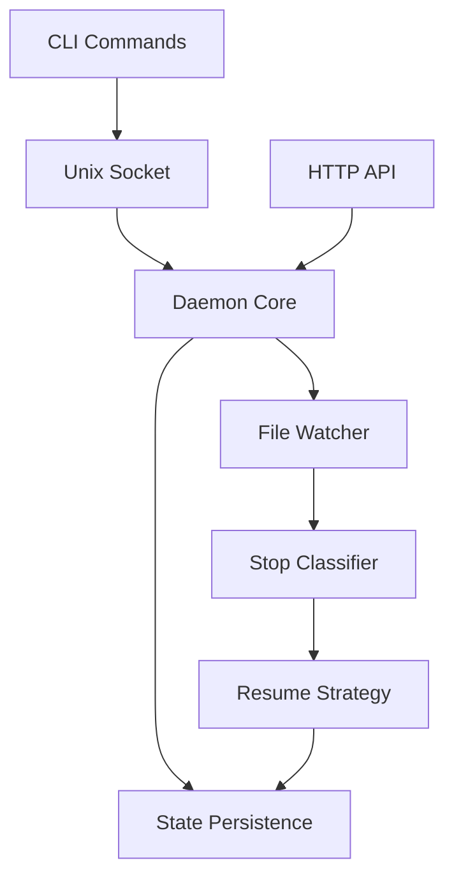
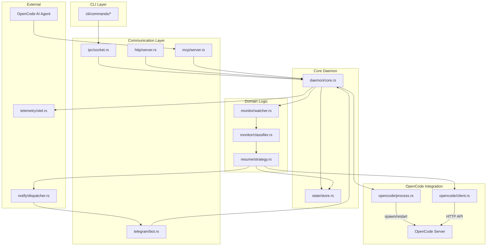
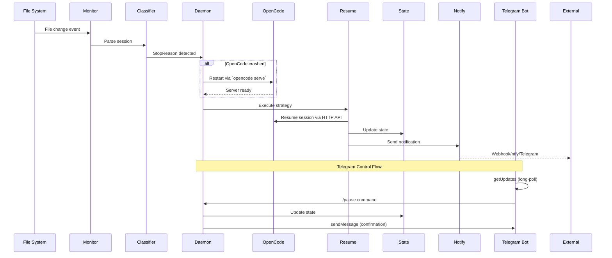

# Architecture Decision Document - palingenesis

_This document builds collaboratively through step-by-step discovery. Sections are appended as we work through each architectural decision together._

**Author:** Jack  
**Date:** 2026-02-05  

---

## Input Documents

| Document | Status | Notes |
|----------|--------|-------|
| PRD | ✅ Loaded | Full requirements for palingenesis daemon |
| UX Design | ❌ N/A | CLI tool - no UX spec needed |
| Research | ❌ Not found | — |
| Project Context | ❌ Not found | — |

---

## Project Context Analysis

### Requirements Overview

**Functional Requirements (48 total):**

| Category | FRs | Description |
|----------|-----|-------------|
| Session Monitoring | FR1-FR7 | Process detection, stop classification, frontmatter parsing |
| Session Resumption | FR8-FR13 | Same-session and new-session resume, backoff, audit trail |
| CLI Control | FR14-FR20 | Daemon lifecycle management, pause/resume/abort |
| Configuration | FR21-FR25 | Config file management, validation, hot reload |
| Notifications | FR26-FR30 | Webhook, Discord, Slack, ntfy.sh integration |
| External Control | FR31-FR34 | Remote commands via chat platforms |
| Observability | FR35-FR40 | OTEL metrics, traces, logs, dashboards |
| MCP Server | FR41-FR44 | MCP stdio interface, JSON-RPC 2.0, OpenCode integration |
| OpenCode Management | FR45-FR48 | Process monitoring, auto-restart, HTTP API integration |
| Telegram Integration | FR49-FR54 | Bi-directional Telegram Bot (notifications + command control) |

**Non-Functional Requirements:**

| Category | Target | Architectural Implication |
|----------|--------|---------------------------|
| Detection latency | <5s | Efficient file watching (inotify/FSEvents) |
| Resume latency | <2s | Pre-computed resume strategies |
| CLI response | <500ms | Async IPC, no blocking |
| Memory | <50MB | Minimal runtime, no GC pressure |
| CPU | <1% idle | Event-driven, not polling |
| Resume success | >95% | Robust error recovery, state persistence |
| Binary size | <10MB | Careful dependency selection |

### Scale & Complexity

- **Primary domain:** CLI tool + daemon hybrid
- **Complexity level:** Medium
- **Estimated components:** 8-10 major modules
- **Concurrency model:** Async (tokio) with state machine

### Technical Constraints & Dependencies

**Constraints:**
1. File-based integration only (no opencode API coupling)
2. Single-user focus for MVP
3. opencode dependency required (not standalone)
4. Windows support deferred to post-MVP

**Dependencies:**

| Crate | Version | Purpose |
|-------|---------|---------|
| tokio | 1.x | Async runtime |
| axum | 0.7+ | HTTP server for control API & webhook endpoints |
| clap | 4.x | CLI argument parsing |
| serde | 1.x | Config/state serialization |
| notify | 6.x | Cross-platform file watching |
| reqwest | 0.11+ | HTTP client for outbound webhooks |
| tracing | 0.1+ | Structured logging |
| opentelemetry | 0.21+ | Metrics/traces (optional) |
| tower | 0.4+ | Middleware stack (pairs with axum) |

### Cross-Cutting Concerns

1. **Async Runtime:** tokio pervades all I/O operations
2. **State Machine:** Session lifecycle requires formal state transitions
3. **Configuration:** Layered config (defaults → file → env → CLI)
4. **Error Handling:** Graceful degradation with structured error types
5. **Platform Abstraction:** Daemon lifecycle differs (systemd vs launchd)
6. **Observability:** OTEL-ready instrumentation from day 1
7. **Testing:** State machine requires property-based and integration tests
8. **Telegram Bot:** Long-polling loop for incoming commands, shared command dispatch with IPC/HTTP

---

## Starter Template Evaluation

### Primary Technology Domain

**Rust CLI Daemon + HTTP API** — A specialized hybrid:
- Long-running background daemon (not a typical CLI tool)
- Embedded HTTP server (axum) for control API
- CLI interface for management commands
- File watching for session monitoring

### Starter Options Considered

| Option | Template | Pros | Cons |
|--------|----------|------|------|
| A | `skanehira/rust-cli-template` | tokio+tracing included, excellent CI/CD | Need to add axum, daemon patterns |
| B | `rust-starter/rust-starter` | Production-ready logging, static binaries | Uses slog, major modifications needed |
| C | `cargo new` (clean start) | Full control, exact deps | Must set up CI/CD from scratch |

### Selected Approach: Hybrid (Template A + customization)

**Rationale:** Use `skanehira/rust-cli-template` for CI/CD foundation, then customize for daemon architecture.

**Initialization Command:**

```bash
cargo generate --git https://github.com/skanehira/rust-cli-template.git --name palingenesis
```

### Verified Dependencies (Feb 2026)

| Crate | Version | Purpose |
|-------|---------|---------|
| tokio | 1.49.0 | Async runtime |
| axum | 0.8.8 | HTTP server for control API |
| clap | 4.5.50 | CLI argument parsing |
| serde | 1.0.228 | Serialization |
| toml | 0.9.11 | Config file parsing |
| notify | 8.2.0 | File system watching |
| reqwest | 0.13.1 | HTTP client (outbound webhooks) |
| tracing | 0.1.44 | Structured logging |
| tracing-subscriber | 0.3.22 | Log formatters |
| tower | 0.5.3 | Middleware |
| tower-http | 0.6.8 | HTTP middleware |
| thiserror | 2.0.17 | Domain error types |
| anyhow | 1.0.100 | Application error handling |
| rmcp | 0.1+ | MCP protocol (JSON-RPC 2.0 over stdio) |

### Cargo.toml

```toml
[package]
name = "palingenesis"
version = "0.1.0"
edition = "2024"
rust-version = "1.85"
description = "Agent resurrection system for continuous AI workflow execution"
license = "MIT"

[dependencies]
# Async runtime
tokio = { version = "1.49", features = ["full"] }

# HTTP server
axum = "0.8.8"
tower = "0.5.3"
tower-http = { version = "0.6.8", features = ["trace", "timeout", "cors"] }

# CLI parsing
clap = { version = "4.5.50", features = ["derive", "env"] }

# Serialization & config
serde = { version = "1.0.228", features = ["derive"] }
toml = "0.9.11"

# File watching
notify = "8.2.0"

# HTTP client (for webhooks)
reqwest = { version = "0.13.1", default-features = false, features = ["json", "rustls-tls"] }

# Logging & tracing
tracing = "0.1.44"
tracing-subscriber = { version = "0.3.22", features = ["json", "env-filter"] }

# Error handling
thiserror = "2.0.17"
anyhow = "1.0.100"

# Optional: OTEL (Growth feature)
opentelemetry = { version = "0.31.0", optional = true }

[target.'cfg(unix)'.dependencies]
nix = { version = "0.29", features = ["signal"] }

[target.'cfg(target_os = "linux")'.dependencies]
systemd = "0.10"

[features]
default = []
otel = ["opentelemetry"]
```

### Project Structure

```
palingenesis/
├── Cargo.toml
├── src/
│   ├── main.rs              # CLI entry point
│   ├── lib.rs               # Library interface
│   ├── daemon/
│   │   ├── mod.rs           # Daemon orchestration
│   │   ├── signals.rs       # SIGTERM/SIGHUP handling
│   │   ├── pid.rs           # PID file management
│   │   └── state.rs         # Session state machine
│   ├── monitor/
│   │   ├── mod.rs           # File watcher orchestration
│   │   ├── session.rs       # Session file parsing
│   │   └── classifier.rs    # Stop reason classification
│   ├── resume/
│   │   ├── mod.rs           # Resume strategy
│   │   ├── same_session.rs  # Continue existing session
│   │   └── new_session.rs   # Start from Next-step.md
│   ├── http/
│   │   ├── mod.rs           # Axum server
│   │   ├── routes.rs        # API routes
│   │   └── handlers.rs      # Request handlers
│   ├── notify/
│   │   ├── mod.rs           # Notification dispatcher
│   │   ├── webhook.rs       # HTTP webhooks
│   │   └── ntfy.rs          # ntfy.sh integration
│   ├── config/
│   │   ├── mod.rs           # Config loading
│   │   └── schema.rs        # Config schema
│   └── cli/
│       ├── mod.rs           # CLI commands
│       └── commands.rs      # start/stop/status/etc
├── config/
│   └── default.toml         # Default configuration
├── systemd/
│   └── palingenesis.service # systemd unit file
└── launchd/
    └── com.palingenesis.plist # macOS launchd
```

---

## Core Architectural Decisions

### Decision Priority Analysis

**Critical Decisions (Block Implementation):**
- State persistence strategy
- CLI-daemon communication mechanism
- API design

**Important Decisions (Shape Architecture):**
- Config file locations
- Daemon management modes
- Log management

**Deferred Decisions (Post-MVP):**
- OTEL integration details
- Multi-assistant support
- Web dashboard

### Data Architecture

| Decision | Choice | Rationale |
|----------|--------|-----------|
| **State Persistence** | File-based (JSON) | Single-user daemon doesn't need SQLite complexity. JSON state file at `~/.local/state/palingenesis/state.json` with file locking. |
| **Session Parsing** | YAML frontmatter only | Only need `stepsCompleted`, `lastStep`, workflow metadata. Body parsing is unnecessary overhead. |
| **Audit Trail** | Append-only JSON lines | `~/.local/state/palingenesis/audit.jsonl` for resume history and metrics. |

**State File Schema:**

```json
{
  "version": 1,
  "daemon_state": "monitoring",
  "current_session": {
    "path": "/path/to/session.md",
    "steps_completed": [1, 2, 3],
    "last_step": 3,
    "total_steps": 12
  },
  "stats": {
    "saves_count": 42,
    "total_resumes": 127,
    "last_resume": "2026-02-05T10:30:00Z"
  }
}
```

### API & Communication

| Decision | Choice | Rationale |
|----------|--------|-----------|
| **CLI-Daemon IPC** | Hybrid (Unix socket + HTTP) | Unix socket for fast CLI commands, HTTP API for external integrations. |
| **Socket Path** | `/run/user/{uid}/palingenesis.sock` | XDG runtime dir, secure, no port conflicts. |
| **HTTP Port** | `127.0.0.1:7654` (configurable) | Localhost only by default, configurable for external access. |

**HTTP API Endpoints:**

```
GET  /health                → { "status": "ok", "uptime": "2h30m" }
GET  /api/v1/status         → { "state": "monitoring", "session": {...} }
POST /api/v1/pause          → { "success": true }
POST /api/v1/resume         → { "success": true }
POST /api/v1/new-session    → { "success": true, "session_id": "..." }
GET  /api/v1/metrics        → Prometheus format
GET  /api/v1/events         → SSE stream of events
```

**Unix Socket Commands:**

```
STATUS  → JSON status response
PAUSE   → OK / ERR
RESUME  → OK / ERR
RELOAD  → OK / ERR (config reload)
```

### Infrastructure & Deployment

| Decision | Choice | Rationale |
|----------|--------|-----------|
| **Config Location** | Platform XDG conventions | Linux: `~/.config/palingenesis/config.toml`, macOS: `~/Library/Application Support/palingenesis/config.toml`. Support `PALINGENESIS_CONFIG` env override. |
| **Daemon Management** | Both modes | `--foreground` for systemd/launchd, default daemonizes for casual users. |
| **Log Management** | Configurable | Default: stderr (for systemd/journald). Optional: file logging at `~/.local/state/palingenesis/daemon.log`. |
| **PID File** | `/run/user/{uid}/palingenesis.pid` | Standard location, cleaned on exit. |

**Platform-Specific Paths:**

| Resource | Linux | macOS |
|----------|-------|-------|
| Config | `~/.config/palingenesis/` | `~/Library/Application Support/palingenesis/` |
| State | `~/.local/state/palingenesis/` | `~/Library/Application Support/palingenesis/` |
| Runtime | `/run/user/{uid}/` | `/tmp/palingenesis-{uid}/` |

### Telegram Bot Architecture

| Decision | Choice | Rationale |
|----------|--------|-----------|
| **Command Ingestion** | Long-polling (`getUpdates`) | Simpler than webhook (no public URL needed), works behind NAT/firewalls, lower operational complexity for single-user daemon. |
| **Bot Framework** | Direct Bot API via `reqwest` | No heavy framework needed. Only `getUpdates`, `sendMessage`, and `answerCallbackQuery` are used. Avoids `teloxide`/`frankenstein` dependency bloat. |
| **Command Dispatch** | Shared `CommandHandler` trait | Telegram commands route through the same `CommandHandler` used by IPC and HTTP, ensuring consistent behavior across all control channels. |
| **Module Location** | `src/telegram/` | Separate from `src/notify/` because Telegram is bi-directional (both inbound commands AND outbound notifications). The existing `src/notify/telegram.rs` handles outbound only; `src/telegram/` handles the bot loop and inbound command parsing. |
| **Polling Loop** | Dedicated tokio task | Spawned as `tokio::spawn` with `CancellationToken` integration. Uses long-polling timeout of 30s to minimize API calls while staying responsive. |

**Telegram Bot API Endpoints Used:**

| Endpoint | Direction | Purpose |
|----------|-----------|---------|
| `getUpdates` | Inbound | Long-poll for incoming commands/messages |
| `sendMessage` | Outbound | Send notifications and command responses |

**Command Parsing:**

Telegram commands map to the same operations as IPC/HTTP:

| Telegram Command | Internal Command | Response |
|------------------|-----------------|----------|
| `/status` | `STATUS` | JSON-formatted status as Telegram message |
| `/pause` | `PAUSE` | Confirmation message |
| `/resume` | `RESUME` | Confirmation message |
| `/skip` | `SKIP` | Confirmation message |
| `/abort` | `ABORT` | Confirmation message |
| `/config` | `CONFIG` | Current config summary |
| `/new_session` | `NEW-SESSION` | Session creation confirmation |
| `/logs` or `/logs N` | `LOGS` | Last N log lines (default 10) |
| `/help` | — | List available commands |

**Security Considerations:**

| Concern | Mitigation |
|---------|------------|
| Unauthorized users sending commands | Validate `chat_id` matches configured value; reject messages from other chats |
| Bot token exposure | Stored in config file with 600 permissions; never logged |
| Rate limiting by Telegram | `getUpdates` long-polling with 30s timeout = ~2 requests/min max |

### Decision Impact Analysis

**Implementation Sequence:**

1. Config schema and loading (foundation)
2. State persistence layer (daemon state)
3. Unix socket IPC (CLI → daemon)
4. HTTP API server (external control)
5. File watcher (session monitoring)
6. Resume strategies (core logic)

**Cross-Component Dependencies:**



---

## Implementation Patterns & Consistency Rules

### Naming Patterns

**Rust Standard (compiler-enforced):**
- Types: `PascalCase` — `SessionState`, `ResumeStrategy`
- Functions/methods: `snake_case` — `parse_frontmatter()`, `start_daemon()`
- Constants: `SCREAMING_SNAKE_CASE` — `DEFAULT_PORT`, `MAX_RETRIES`
- Modules: `snake_case` — `session_monitor`, `stop_classifier`

**File Naming:**
```
src/daemon/mod.rs          # Module root
src/daemon/signals.rs      # Submodule
tests/integration/daemon_test.rs  # Integration test
```

**JSON Field Naming (API responses):**
- Use `snake_case` — `{ "daemon_state": "monitoring", "saves_count": 42 }`

### Error Handling Patterns

| Location | Use | Example |
|----------|-----|---------|
| `src/monitor/`, `src/resume/` | `thiserror` | `ParseError`, `ResumeError` |
| `src/cli/`, `src/http/handlers.rs` | `anyhow` | CLI/HTTP handlers |

**Error Type Pattern:**

```rust
#[derive(Debug, thiserror::Error)]
pub enum MonitorError {
    #[error("Failed to parse frontmatter: {0}")]
    ParseFrontmatter(#[from] serde_yaml::Error),
    
    #[error("Session file not found: {path}")]
    SessionNotFound { path: PathBuf },
}
```

### Module Structure Patterns

**Public API Rule:** Only expose what's needed via `mod.rs` re-exports.

```rust
// src/monitor/mod.rs
mod classifier;
mod session;
mod watcher;

pub use classifier::StopReason;
pub use session::{Session, SessionState};
pub use watcher::SessionWatcher;
```

### Async Patterns

**Channel Selection:**

| Use Case | Channel Type |
|----------|--------------|
| One producer, one consumer | `tokio::sync::mpsc` |
| Broadcast (shutdown signal) | `tokio::sync::broadcast` |
| Single value (oneshot) | `tokio::sync::oneshot` |
| Watch (latest value) | `tokio::sync::watch` |

**Graceful Shutdown:** Use `CancellationToken` for coordinated shutdown.

**Spawning Pattern:** Always instrument spawned tasks:
```rust
tokio::spawn(async move { ... }.instrument(info_span!("http_server")));
```

### Testing Patterns

| Test Type | Location | Naming |
|-----------|----------|--------|
| Unit tests | Inline `#[cfg(test)]` | `test_*` |
| Integration tests | `tests/` directory | `*_test.rs` |
| Fixtures | `tests/fixtures/` | descriptive |

### Logging Patterns

**Structured Logging:**
```rust
info!(session_path = %path, steps_completed = steps.len(), "Session loaded");
```

**Log Levels:**
- `error!` — Unrecoverable errors
- `warn!` — Recoverable issues
- `info!` — Significant events
- `debug!` — Detailed flow
- `trace!` — Very verbose

### API Response Patterns

**Success:** `{ "success": true, "data": { ... } }`

**Error:** `{ "success": false, "error": { "code": "SESSION_NOT_FOUND", "message": "..." } }`

### Enforcement Guidelines

**All AI Agents MUST:**
1. Follow Rust naming conventions
2. Use `thiserror` for domain errors, `anyhow` for application code
3. Re-export public types through `mod.rs`
4. Use `CancellationToken` for graceful shutdown
5. Write unit tests inline, integration tests in `tests/`
6. Use structured logging with `tracing`
7. Return consistent API response format

---

## Project Structure & Boundaries

### Requirements to Module Mapping

| FR Category | Module | Key Files |
|-------------|--------|-----------|
| Session Monitoring (FR1-FR7) | `src/monitor/` | `watcher.rs`, `session.rs`, `classifier.rs` |
| Session Resumption (FR8-FR13) | `src/resume/` | `strategy.rs`, `same_session.rs`, `new_session.rs` |
| CLI Control (FR14-FR20) | `src/cli/` | `commands.rs`, `daemon.rs` |
| Configuration (FR21-FR25) | `src/config/` | `schema.rs`, `loader.rs` |
| Notifications (FR26-FR30) | `src/notify/` | `webhook.rs`, `ntfy.rs`, `telegram.rs`, `dispatcher.rs` |
| External Control (FR31-FR34) | `src/http/` | `handlers.rs`, `routes.rs` |
| Observability (FR35-FR40) | `src/telemetry/` | `metrics.rs`, `traces.rs` |
| MCP Server (FR41-FR44) | `src/mcp/` | `server.rs`, `tools.rs`, `handlers.rs` |
| OpenCode Management (FR45-FR48) | `src/opencode/` | `process.rs`, `client.rs`, `session.rs` |
| Telegram Integration (FR49-FR54) | `src/telegram/` | `bot.rs`, `commands.rs`, `polling.rs` |

### Complete Project Directory Structure

```
palingenesis/
├── .github/
│   └── workflows/
│       ├── ci.yml                    # Lint, test, audit
│       ├── release.yml               # Cross-platform builds
│       └── benchmark.yml             # Performance tracking
├── config/
│   └── default.toml                  # Default configuration template
├── systemd/
│   └── palingenesis.service          # Linux systemd unit
├── launchd/
│   └── com.palingenesis.plist        # macOS launchd plist
├── tests/
│   ├── fixtures/
│   │   ├── session_rate_limit.md     # Test session file
│   │   ├── session_context_exhausted.md
│   │   └── config_valid.toml
│   └── integration/
│       ├── daemon_test.rs            # Daemon lifecycle tests
│       ├── monitor_test.rs           # File watcher tests
│       ├── resume_test.rs            # Resume strategy tests
│       └── http_test.rs              # API endpoint tests
├── src/
│   ├── main.rs                       # Entry point, CLI dispatch
│   ├── lib.rs                        # Library root, re-exports
│   ├── prelude.rs                    # Common imports
│   │
│   ├── cli/
│   │   ├── mod.rs                    # CLI module root
│   │   ├── app.rs                    # Clap App definition
│   │   └── commands/
│   │       ├── mod.rs
│   │       ├── daemon.rs             # start, stop, restart, reload
│   │       ├── status.rs             # status, health
│   │       ├── config.rs             # config init, validate, show
│   │       └── logs.rs               # logs --follow --tail
│   │
│   ├── daemon/
│   │   ├── mod.rs                    # Daemon orchestration
│   │   ├── core.rs                   # Main daemon loop
│   │   ├── signals.rs                # SIGTERM, SIGHUP, SIGINT
│   │   ├── pid.rs                    # PID file management
│   │   ├── state.rs                  # DaemonState enum
│   │   └── shutdown.rs               # Graceful shutdown coordination
│   │
│   ├── monitor/
│   │   ├── mod.rs                    # Monitor module root
│   │   ├── watcher.rs                # File system watcher (notify)
│   │   ├── session.rs                # Session file parsing
│   │   ├── frontmatter.rs            # YAML frontmatter extraction
│   │   ├── classifier.rs             # Stop reason classification
│   │   └── error.rs                  # MonitorError type
│   │
│   ├── resume/
│   │   ├── mod.rs                    # Resume module root
│   │   ├── strategy.rs               # ResumeStrategy trait
│   │   ├── same_session.rs           # Continue existing session
│   │   ├── new_session.rs            # Start from Next-step.md
│   │   ├── backoff.rs                # Exponential backoff logic
│   │   └── error.rs                  # ResumeError type
│   │
│   ├── http/
│   │   ├── mod.rs                    # HTTP server setup
│   │   ├── server.rs                 # Axum server configuration
│   │   ├── routes.rs                 # Route definitions
│   │   ├── handlers/
│   │   │   ├── mod.rs
│   │   │   ├── health.rs             # GET /health
│   │   │   ├── status.rs             # GET /api/v1/status
│   │   │   ├── control.rs            # POST pause/resume/new-session
│   │   │   ├── metrics.rs            # GET /api/v1/metrics
│   │   │   └── events.rs             # GET /api/v1/events (SSE)
│   │   ├── middleware.rs             # Tracing, auth middleware
│   │   └── error.rs                  # AppError → Response
│   │
│   ├── mcp/
│   │   ├── mod.rs                    # MCP module root
│   │   ├── server.rs                 # stdio transport, JSON-RPC 2.0
│   │   ├── tools.rs                  # MCP tool definitions
│   │   └── handlers.rs               # Tool handlers → DaemonState
│   │
│   ├── opencode/
│   │   ├── mod.rs                    # OpenCode integration root
│   │   ├── process.rs                # Process monitoring & restart
│   │   ├── client.rs                 # HTTP client for OpenCode API
│   │   └── session.rs                # Session management via API
│   │
│   ├── ipc/
│   │   ├── mod.rs                    # IPC module root
│   │   ├── socket.rs                 # Unix socket server
│   │   ├── protocol.rs               # Command/response protocol
│   │   └── client.rs                 # CLI → daemon client
│   │
│   ├── notify/
│   │   ├── mod.rs                    # Notification dispatcher
│   │   ├── dispatcher.rs             # Event → channel routing
│   │   ├── webhook.rs                # HTTP POST notifications
│   │   ├── ntfy.rs                   # ntfy.sh integration
│   │   ├── telegram.rs               # Telegram outbound notifications
│   │   └── channel.rs                # NotificationChannel trait
│   │
│   ├── telegram/
│   │   ├── mod.rs                    # Telegram bot module root
│   │   ├── bot.rs                    # Bot lifecycle management
│   │   ├── polling.rs                # getUpdates long-polling loop
│   │   └── commands.rs               # Command parsing & dispatch
│   │
│   ├── config/
│   │   ├── mod.rs                    # Config module root
│   │   ├── schema.rs                 # Config struct definitions
│   │   ├── loader.rs                 # File/env/CLI config loading
│   │   ├── paths.rs                  # Platform-specific paths
│   │   └── validation.rs             # Config validation
│   │
│   ├── state/
│   │   ├── mod.rs                    # State persistence
│   │   ├── store.rs                  # JSON file read/write
│   │   ├── schema.rs                 # State file schema
│   │   └── audit.rs                  # Audit trail (JSONL)
│   │
│   └── telemetry/
│       ├── mod.rs                    # Telemetry setup
│       ├── tracing.rs                # Tracing subscriber setup
│       ├── metrics.rs                # Prometheus metrics (optional)
│       └── otel.rs                   # OpenTelemetry export (optional)
│
├── Cargo.toml                        # Dependencies
├── Cargo.lock                        # Locked versions
├── rust-toolchain.toml               # Rust version pinning
├── .gitignore
├── README.md
├── LICENSE
└── CHANGELOG.md
```

### Architectural Boundaries



### Integration Points

**Internal Communication:**

| From | To | Mechanism |
|------|-----|-----------|
| CLI → Daemon | Unix socket (`ipc/`) | Request/response protocol |
| HTTP → Daemon | Axum handlers | Shared `AppState` |
| MCP → Daemon | stdio (`mcp/`) | JSON-RPC 2.0 protocol |
| Telegram → Daemon | `tokio::sync::mpsc` | `TelegramCommand` channel |
| Monitor → Daemon | `tokio::sync::mpsc` | `MonitorEvent` channel |
| Daemon → Notify | `tokio::sync::mpsc` | `NotificationEvent` channel |

**External Integrations:**

| Integration | Module | Protocol |
|-------------|--------|----------|
| opencode session files | `monitor/session.rs` | File read (YAML frontmatter) |
| OpenCode Server API | `opencode/client.rs` | HTTP (REST API on port 4096) |
| OpenCode MCP client | `mcp/server.rs` | stdio + JSON-RPC 2.0 |
| OpenCode process | `opencode/process.rs` | Process spawn (`opencode serve`) |
| Webhook endpoints | `notify/webhook.rs` | HTTP POST |
| ntfy.sh | `notify/ntfy.rs` | HTTP POST |
| Telegram Bot API (outbound) | `notify/telegram.rs` | HTTP POST (`sendMessage`) |
| Telegram Bot API (inbound) | `telegram/polling.rs` | HTTP GET (`getUpdates` long-poll) |
| Prometheus | `http/handlers/metrics.rs` | HTTP GET (scrape) |
| OTLP collector | `telemetry/otel.rs` | gRPC/HTTP (optional) |

### Data Flow



---

## Architecture Validation Results

### Coherence Validation ✅

**Decision Compatibility:**
- tokio 1.49 + axum 0.8: Compatible async ecosystem
- clap 4.5 + tokio: Async CLI commands work
- notify 8.2 + tokio: Async file watching
- tracing + tower-http: Integrated request tracing
- thiserror + anyhow: Complementary error handling

**Pattern Consistency:**
- Naming conventions: Rust standard throughout
- Error handling: Domain (thiserror) vs app (anyhow) clear
- Module structure: Consistent re-export pattern
- Async patterns: CancellationToken + channels defined

**Structure Alignment:**
- Modules match all 8 FR categories (including Telegram FR41-FR46)
- Test structure follows inline unit / integration in `tests/`
- Config paths platform-specific via `dirs` crate

### Requirements Coverage Validation ✅

| FR Category | Module | Status |
|-------------|--------|--------|
| FR1-FR7 (Session Monitoring) | `monitor/` | ✅ |
| FR8-FR13 (Session Resumption) | `resume/` | ✅ |
| FR14-FR20 (CLI Control) | `cli/`, `daemon/` | ✅ |
| FR21-FR25 (Configuration) | `config/` | ✅ |
| FR26-FR30 (Notifications) | `notify/` | ✅ |
| FR31-FR34 (External Control) | `http/` | ✅ |
| FR35-FR40 (Observability) | `telemetry/` | ✅ |
| FR41-FR44 (MCP Server) | `mcp/` | ✅ |
| FR45-FR48 (OpenCode Management) | `opencode/` | ✅ |
| FR49-FR54 (Telegram Integration) | `telegram/`, `notify/telegram.rs` | ✅ |

**NFR Coverage:**
- <5s detection: inotify/FSEvents ✅
- <2s resume: Pre-computed strategies ✅
- <500ms CLI: Unix socket IPC ✅
- <50MB memory: No GC, minimal deps ✅
- <1% CPU idle: Event-driven ✅
- >95% resume: Graceful degradation ✅
- <10MB binary: Careful deps ✅

### Implementation Readiness ✅

- All crate versions verified (Feb 2026)
- All config locations defined per platform
- All API endpoints documented
- State file schema defined
- IPC protocol defined
- 60+ files specified in project structure

### Gap Analysis

**Critical Gaps:** None ✅

**Post-MVP:**
- Windows support
- Multi-assistant monitoring
- Web dashboard
- OTEL trace propagation details
- Telegram webhook mode (alternative to long-polling for advanced deployments)

### Architecture Completeness Checklist

- [x] Project context analyzed
- [x] Scale/complexity assessed (Medium)
- [x] Technical constraints identified
- [x] Cross-cutting concerns mapped (7)
- [x] Critical decisions with versions
- [x] Technology stack specified (9 crates + Telegram Bot API via reqwest)
- [x] Integration patterns defined
- [x] Naming conventions established
- [x] Structure patterns defined
- [x] Communication patterns specified
- [x] Complete directory structure (65+ files including telegram/)
- [x] Component boundaries established
- [x] Integration points mapped
- [x] Requirements mapping complete

### Architecture Readiness

**Status:** ✅ READY FOR IMPLEMENTATION

**Confidence:** HIGH

**Strengths:**
1. Clean separation of concerns
2. Proven technology stack (tokio ecosystem)
3. Comprehensive error handling
4. Platform-aware design
5. Growth features isolated

---
